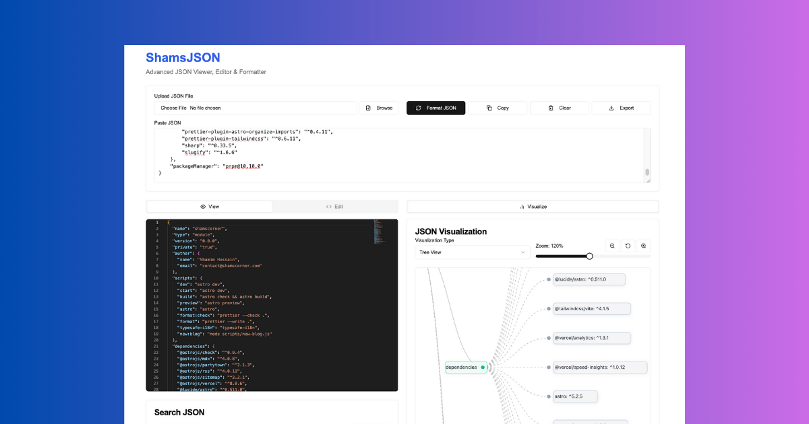

# ShamsJSON 🚀

**ShamsJSON** is a powerful, feature-rich JSON viewer and editor built with Next.js 15 and modern web technologies. It provides an intuitive interface for formatting, validating, searching, transforming, and visualizing JSON data - perfect for developers and data analysts.



## ✨ Features

### 🔧 Core JSON Operations

- **Format & Validate**: Automatically format and validate JSON with syntax highlighting
- **Import/Export**: Load JSON from files or URLs, export formatted results
- **Copy to Clipboard**: Quick copy functionality for formatted JSON

### 🔍 Advanced Search & Navigation

- **Smart Search**: Search through JSON data with advanced filtering options
- **JSONPath Queries**: Execute JSONPath expressions to extract specific data
- **Key-Value Navigation**: Easy navigation through complex nested structures

### 🎨 Visualization Tools

- **Tree Visualization**: Interactive tree view of JSON structure
- **Network Graph**: Visualize relationships in your JSON data
- **Syntax Highlighting**: Beautiful code highlighting with Monaco Editor

### 🔄 Data Transformation

- **JSON Transforms**: Apply custom transformations to your data
- **Data Manipulation**: Edit and modify JSON structures directly
- **Batch Operations**: Perform operations on multiple JSON files

### 🎯 Developer Experience

- **Dark/Light Theme**: Comfortable viewing in any environment
- **Responsive Design**: Works perfectly on desktop and mobile devices
- **Keyboard Shortcuts**: Efficient navigation with keyboard shortcuts
- **Error Handling**: Clear error messages and validation feedback

## 🚀 Getting Started

### Prerequisites

- Node.js 18+
- pnpm (recommended) or npm

### Installation

1. **Clone the repository**

   ```bash
   git clone https://github.com/shamscorner/shamsjson.git
   cd shamsjson
   ```

2. **Install dependencies**

   ```bash
   pnpm install
   # or
   npm install
   ```

3. **Run the development server**

   ```bash
   pnpm dev
   # or
   npm run dev
   ```

4. **Open your browser**
   Navigate to [http://localhost:3000](http://localhost:3000)

## 🛠️ Tech Stack

- **Framework**: [Next.js 15](https://nextjs.org/) with App Router
- **Styling**: [Tailwind CSS](https://tailwindcss.com/) + [shadcn/ui](https://ui.shadcn.com/)
- **Editor**: [Monaco Editor](https://microsoft.github.io/monaco-editor/) (VS Code editor)
- **Visualization**: [D3.js](https://d3js.org/) for data visualization
- **Type Safety**: [TypeScript](https://www.typescriptlang.org/) for robust development
- **Package Manager**: [pnpm](https://pnpm.io/) for fast, efficient installs

## 📁 Project Structure

```
shamsjson/
├── app/                    # Next.js App Router
│   ├── globals.css        # Global styles
│   ├── layout.tsx         # Root layout with SEO
│   ├── page.tsx           # Home page
│   ├── robots.ts          # SEO robots.txt
│   └── sitemap.ts         # XML sitemap
├── components/            # React components
│   ├── ui/               # shadcn/ui components
│   ├── json-editor.tsx   # Monaco-based JSON editor
│   ├── json-search.tsx   # Search functionality
│   ├── json-tool.tsx     # Main tool component
│   ├── json-transform.tsx # Data transformation
│   ├── json-visualizer.tsx # Tree visualization
│   ├── network-graph.tsx # Network graph visualization
│   └── tree-graph.tsx    # Tree graph component
├── hooks/                # Custom React hooks
├── lib/                  # Utility functions
├── public/               # Static assets
└── styles/               # Additional stylesheets
```

## 🎯 Usage Examples

### Basic JSON Formatting

1. Paste your JSON data into the editor
2. Click "Format JSON" to beautify and validate
3. Copy the formatted result

### Advanced Search

1. Load your JSON data
2. Switch to the "Search" tab
3. Use JSONPath expressions like `$.users[*].name` to extract specific data

### Data Visualization

1. Load complex JSON data
2. Navigate to the "Visualize" tab
3. Explore your data structure in an interactive tree or network view

### JSON Transformation

1. Load your source JSON
2. Go to the "Transform" tab
3. Apply custom transformation rules to reshape your data

## 🔗 API Reference

### JSON Editor Component

```tsx
import JsonEditor from "@/components/json-editor";

<JsonEditor
  value={jsonString}
  onChange={setJsonString}
  language="json"
  theme="vs-dark"
/>;
```

### JSON Visualizer Component

```tsx
import JsonVisualizer from "@/components/json-visualizer";

<JsonVisualizer data={jsonData} width={800} height={600} />;
```

## 🤝 Contributing

We welcome contributions! Please see our [Contributing Guidelines](CONTRIBUTING.md) for details.

### Development Workflow

1. Fork the repository
2. Create a feature branch: `git checkout -b feature/amazing-feature`
3. Make your changes
4. Run tests: `pnpm test`
5. Commit changes: `git commit -m 'Add amazing feature'`
6. Push to branch: `git push origin feature/amazing-feature`
7. Open a Pull Request

## 📝 License

This project is licensed under the MIT License - see the [LICENSE](LICENSE) file for details.

## 🙏 Acknowledgments

- [Next.js](https://nextjs.org/) team for the amazing framework
- [shadcn/ui](https://ui.shadcn.com/) for the beautiful component library
- [Monaco Editor](https://microsoft.github.io/monaco-editor/) for the powerful code editor
- [D3.js](https://d3js.org/) for data visualization capabilities

## 📞 Support & Contact

- **Website**: [shamsjson.com](https://shamsjson.com)
- **Issues**: [GitHub Issues](https://github.com/shamscorner/shamsjson/issues)
- **Discussions**: [GitHub Discussions](https://github.com/shamscorner/shamsjson/discussions)

## 🗺️ Roadmap

- [ ] Real-time collaboration features
- [ ] JSON schema validation
- [ ] Custom theme support
- [ ] Plugin system for custom transformations
- [ ] Performance optimizations for large JSON files
- [ ] Mobile app version
- [ ] API endpoint for programmatic access

---

**Built with ❤️ by [Shams Corner](https://github.com/shamscorner)**

_Star ⭐ this repository if you find it useful!_
